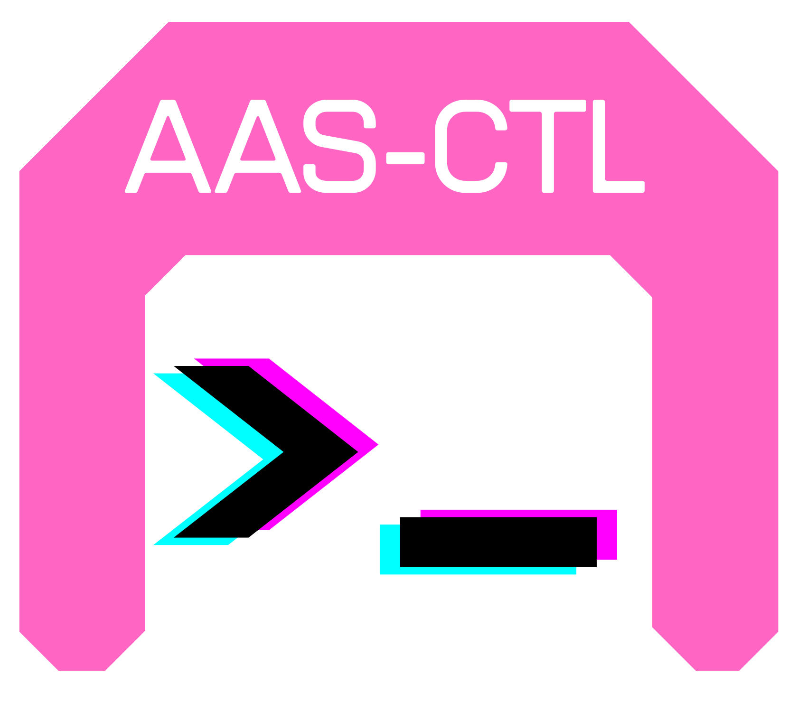

# AAS-CTL - Asset Administration Shell Command Line Tool
<p align="center">
    
</p>

A simple, user-friendly command line tool to browse and interact with **Asset Administration Shell (AAS)** repositories.

This command line tool can be used to:

- connect to remote or local AAS repositories
- manage multiple repository profiles via configuration
- easy access to repositories via the command line in a human readable way
- display Shells/Submodels and its contents (show)
- list all Shells/Submodels in the repository (list)
- filter for Shells matching specified criteria (search)
- discover repositories via a top down (file-explorer) like approach (discover)
- execute REST-API requests (get, patch, post, put)

### Main Contributors
- [Silas Baumann](https://github.com/s-lias) 🏆
- [Moritz Dorn](https://github.com/Moritz-Dorn)

## Contents

1. [Getting Started](#getting-started)
    - [Installation](#installation)
    - [Configuration](#configuration)
    - [Basic access](#basic-access)
    - [Filter shells for matching criteria](#filter-shells-for-matching-criteria)
    - [Discovering the repository](#discovering-the-repository)
2. [API](#api)
    - [Usage](#usage)
    - [Formatting](#formatting)
3. [Example usage](#example-usage)
4. [AI Agent Integration](#ai-agent-integration)
    - [What the agent can do](#what-the-agent-can-do)
5. [Contributing](#contributing)

## Getting Started

### Installation

#### Prerequisites

Go 1.24+ installed ([download](https://go.dev/dl))

Verify:

```shell
go version
```

#### Option 1: Install via go install (recommended)

```shell
go install github.com/KIT-IRS/aas-ctl@latest
```

Test:

```shell
aas-ctl version
```

#### Option 2: Build from source

```shell
git clone https://github.com/KIT-IRS/aasctl.git
cd aasctl
go install .
```

Test:

```shell
aas-ctl version
```

### Configuration

Before being able to use aas-ctl there are a few things to be done regarding the configuration.

1. Upon first install, the config file has to be created (see [Config file](#config-file))
2. One or multiple profiles have to be created (see [Profile creation and editing](#profile-creation-and-editing))
3. One profile has to be selected (see [Profile selection](#profile-selection))

#### Config file

The config file can hold the information of different repository profiles and is required for aas-ctl to work.
It is stored in the home directory "~/.aas/config.json" and looks like this [example config](/config/config.json).
The config path for your device can be aquired by running the [config show](#config-show) command, e.g. (for Windows):

```shell
$aas-ctl config show
C:\Users\user/.aas/config.json
```

After the first installation of aas-ctl the config file does not exist yet and needs to be created.
There are two ways to achieve this:

1. Copy the [example config](/config/config.json) to "~/.aas/config.json"
2. Run the following command to create a new (empty) profile with the given \<name> which also creates the config file, if there is none yet

Command:

```shell
aas-ctl config create <name>
```

The [example config](/config/config.json) contains two example profiles, which probably will not point at any repository.
An empty profile that is created using the "config create" command doesn't point at any repository at all.
Therefore in the next step, the profile has to be edited (see next section).

#### Profile creation and editing

To connect to a repository, first a profile for the repository has to be created.
A profile consists of

- a name used to identify it,
- a URL of the repository,
- the ports of the endpoints.

An example profile is displayed here:

```json
{
    "name": "example",
    "url": "http://example.com/example",
    "ports": {
        "discovery": 8084,
        "registry": 8082,
        "sm-registry": 8083,
        "repository": 8081,
        "sm-repository": 8081,
        "concept-descriptions": 8081
    }
}
```

It is possible to have multiple profiles to choose from.
All profiles are stored in the config file (see [Config file](#config-file)).

To create, edit or delete a profile, you can directly edit the config file.
This is the **only** way to edit or delete a profile.

Note: It is suggested to delete the example profiles, if you choose to copy the example config.

For the profile creation the following command can also be used:

```shell
aas-ctl config create <name>
```

where \<name> is the name of the profile which **must be unique**, because the profile selection is by the profile name.

#### Profile selection

To avoid having to specify the profile with every command, you can select a profile that will be used for subsequent commands until another profile is selected.

To select a profile, run the command

```shell
aas-ctl config select <name>
```

where \<name> is the name of a profile specified in the config file.

After that, all commands accessing a repository will access the one specified in that profile.

To see which profiles are available for selection, run

```shell
aas-ctl config list
```

This will output a list of all available profiles, where the active profile is highlighted in green, if there is one.

After the selection of the desired profile, you can start accessing and discovering the repository.

### Basic access

After selecting a profile to specify the repository you want to access, you can start with the basic commands.

#### Accessing shells

Lets get started with the first basic commands for accessing the shells of a repository.

##### Listing repository shells

To just list all shells in the repository, run

```shell
aas-ctl aas list
```

or shorter

```shell
aas-ctl list
```

which is just an alias and executes the same command.

This will give you a list of all shells in the repository with their ID and IDShort.

##### Showing shell contents

To see what is inside a shell, or more specifically to see the submodels of a shell, run

```shell
aas-ctl aas show <identifier>
```

where \<identifier> is either an ID or an IDShort.

This will give you a list of all submodels in that shell, with their ID and IDShort,

#### Accessing submodels

Similar to the access of shells, submodels can be accessed too.

##### Listing repository submodels

To just list all submodels in a repository, run

```shell
aas-ctl sm list
```

This will give you a list of all submodels in the repository with their ID and IDShort.

##### Showing submodel contents

To show the contents of a submodel, run

```shell
aas-ctl sm show <identifier>
```

where \<identifier> is either the ID or IDShort of a submodel.

This will give you a list of all SubmodelElements of the submodel with their IDShort (if existing), its type and its value (if it has one).

Note: It is possible that there are multiple submodels with the same IDShort in a repository, since the IDShort does not need to be unique.
So running the show command with an IDShort does not necessarily return the contents of the submodel you wanted, but the contents of one with the same IDShort.

To solve this problem, either

- ensure the IDShort of the submodel is unique in the repository,
- access the submodel via its ID,
- specify the shell the submodel is in.

For the last option, run

```shell
aas-ctl sm show <idShort> --aas <identifier>
```

to get the desired submodel, since the IDShort must be unique inside the shell.

Note: Here the submodel \<identifier> must be its \<idShort>, otherwise the --aas flag would be redundant.

The --aas flag works for all sm commands so you could list all submodels of a shell by running

```shell
aas-ctl sm list --aas <identifier>
```

which would return the same result as described in [Showing shell contents](#showing-shell-contents)

#### Accessing submodel elements

Accessing submodel elements works a bit different than the access of shells and submodels, since shells and submodels are Identifiables, while submodel elements are Referables.

The main difference is, that shells and submodels are stored in their own repositories and are uniquely identifiable (ID), while submodel elements are stored inside a submodel and only referable (IDShort) through the submodel.

##### Showing submodel elements

To show the content of a submodel element, run

```shell
aas-ctl sm show <identifier> --elementId <idShort>
```

to show the content of the submodel element with \<idShort> of submodel \<identifier>.

Since the submodel elements are stored inside a list, you can also access a submodel element via its index in this list.
This is especially useful if the submodel element does not have an IDShort.
In this case simply run

```shell
aas-ctl sm show <identifier> --elementIdx <index>
```

where index is the index of the submodel element in the submodel.

Note: The flags --elementId and --elementIdx are mutually exclusive, which means only one of them may be set.

##### Submodel element values

If you only want to access the value of a submodel element, you can do this by adding the --value flag to the command.
E.g.

```shell
aas-ctl sm show <identifier> --elementId <IDShort> --value
```

this also works using the --elementIdx flag.

The output of this command depends on the type of the submodel element.
The value attribute is not well defined for all submodel elements, so here is a list of the outputs of the different submodel elements:

- Property: value
- MultiLanguageProperty: first language entry value

Note: Since the value is not necessarily defined for all types of submodel elements, the value output is not implemented for all of them and may return an error.

### Filter shells for matching criteria

It may be necessary to filter for some shells, that match some criteria.
E.g. you want to find all shells of assets of a given manufacturer.

Therefore you can use the search command, which searches all shells, that fulfill all criteria.

The command looks like this

```shell
aas-ctl search [--sm <smIDShort>] [--elementId <elemIDShort> | --elementIdx <idx>] [--value <value>]
```

All of the flags are optional, running the command without any flags just returns a list of all shells, since there is no filter criteria.

Flags:

- --sm \<smIDShort> specifies that the shell must contain a submodel with this IDShort
- --elementId \<elemIDShort> specifies that the shell must contain a submodel containing a submodel element with this IDShort
- --elementIdx \<idx> specifies that the shell must contain a submodel containing a submodel element at this index
- --value \<value> specifies that the shell must contain a submodel containing a submodel element with this value

Supplying multiple flags, means that all must be true for the same submodel/submodel element of the shell.

E.g.

```shell
aas-ctl search --sm smIDShort --elementId elemIDShort --value 0
```

returns only the shells where the submodel with IDShort "smIDShort" contains a submodel element with the element "elemIDShort" and that element has the value 0.

### Discovering the repository

To trace a possibly nested path of IDShorts through the repository, you can use the discover command.
This allows you to navigate through the repository using the human readable IDShorts and access even nested submodel element values.

To execute the command, run

```shell
aas-ctl discover arg1 [arg2 [arg3 [...]]]
```

where the args are IDShorts dependent on the current "position" in the repository.
This outputs either a list of sub-elements from your current "position", where you can go deeper by just adding one of the possibilities as next arg, or the value of the element, if you reached the "bottom" (a submodel element that contains no more nesting).

The first argument has to be an ID or IDShort of an Identifiable (Shell or Submodel).
From that on, you get the possibilities for the next argument from the output of the previous.

#### Example 1

Your first argument is an IDShort of a Shell,

```shell
$ aas-ctl discover shellIDShort
sm1ID<Submodel> sm1IDShort
sm2ID<Submodel> sm2IDShort
sm3ID<Submodel> sm3IDShort
```

this returns a list of the submodels of that shell.

You can now select the submodel you want to access, e.g. in this case the second one

```shell
$ aas-ctl discover shellIDShort sm2IDShort
elem1IDshort
elem2IDshort
elem3IDshort
elem4IDshort
elem5IDshort
```

this returns now the submodel elements of the second submodel.

To see what's inside the first element, run

```shell
$ aas-ctl discover shellIDShort sm2IDShort elem1IDshort
0
```

in this case, the element is a Property, therefore the return is its value.

Suppose the fifth element is a SubmodelElementCollection:

```shell
$ aas-ctl discover shellIDShort sm2IDShort elem5IDshort
colElem1IDShort
colElem2IDShort
colElem3IDShort
```

this would return a list of the elements in the collection, which you cold access even further.
This chain always ends, if the accessed element isn't a nested element (collection or list).

#### Example 2

Your first argument is an ID of a submodel, running

```shell
$ aas-ctl discover smID
elem1IDshort
elem2IDshort
elem3IDshort
elem4IDshort
elem5IDshort
```

returns a list of all submodel elements of that submodel.
In this case the submodel of this example is the same as the one with sm2IDshort in [Example 1](#example-1).

Notice that the difference between this and the previous example is solely a different "starting point" for the discovery.
While in the first example the shell was chosen, in the second one it was the submodel, but both lead to the same result.

## API

### Usage

```shell
aas-ctl <command> [flags]
```

#### Commands

##### aas

```shell
aas-ctl aas <command> [--id]
```

If the --id flag is provided, the output only contains the id of the shell(s).

###### aas list

```shell
aas-ctl aas list [--id]
```

Returns a list of all shells in the current repository.

###### aas show

```shell
aas-ctl aas show <identifier> [--id]
```

Returns a list of the submodels of the shell specified by \<identifier>.

##### config

```shell
aas-ctl config <command>
```

###### config create

```shell
aas-clt config create <name>
```

Create a new empty profile with the specified \<name>.
The profile has to be edited before it can be used (see [Profile creation and editing](#profile-creation-and-editing)).

###### config list

```shell
aas-ctl config list
```

Returns a list of all available profiles defined in the config file.
The currently selected profile is highlighted in green.

###### config select

```shell
aas-ctl config select <name>
```

Select the config with the provided \<name> as active config.

###### config show

```shell
aas-ctl config show
```

Returns the path to the config file.

##### discover

```shell
aas-ctl discover arg1 [arg2 [...]]
```

Returns
a list of sub-elements to the current path specified by the arguments
or
the value of the element specified by the arguments if there are no sub-elements.
See [Discovering the repository](#discovering-the-repository) for further explanation.

##### list

```shell
aas-ctl list
```

Returns a list of all shells in the current repository.

##### search

```shell
aas-ctl search [--sm <smIDShort>] [--elementId <elemIDShort> | --elementIdx <elemIdx>] [--value <value>]
```

Returns a list of shells that match the criteria specified with the flags.
See [Filter shells for matching criteria](#filter-shells-for-matching-criteria) for further explanation.

##### show

```shell
aas-ctl show <identifier>
```

Returns a list of the contents of the identifiable specified by \<identifier> (identifiable may be a shell or a submodel, identifier may be an ID or IDShort).

##### sm

```shell
aas-ctl sm <command> [--aas <identifier>] [flags]
```

If the --aas flag is provided, the output only contains data of submodels of the shell with the provided \<identifier> (identifier may be an ID or IDShort).

###### sm list

```shell
aas-ctl sm list [--aas <identifier>]
```

Returns a list of all submodels in the repository.
If the --aas flag is provided, only the submodels of the shell specified by \<identifier> are returned.

###### sm show

```shell
aas-ctl sm show <identifier> [--aas <aasIdentifier>] [--elementId <elemIDShort> [--value] | --elementIdx <elemIdx> [--value]]
```

Return the submodel specified by \<identifier> (identifier may be an ID or IDShort).
If the --aas flag is provided, \<identifier> must be an IDShort.

If the --elementId flag is provided, the submodel element specified by \<elemIDShort> is returned instead.
If additionaly the --value flag is provided, only the submodel element value is returned.

If the --elementIdx flag is provided, the submodel element specified by \<elemIdx> is returned instead.
If additionaly the --value flag is provided, only the submodel element value is returned.

The flags --elementId and --elementIdx are mutually exclusive, so at most one of them may be provided.

#### get

```shell
aas-ctl get <url>
```

Executes a get request on the given URL and outputs the response to the command line.

#### patch

```shell
aas-ctl patch <url> <value>
```

Executes a patch request on the given URL with the provided value, to change a Submodel Element Value.
Patch requests can only be executed on Submodel Element Values, whose URLs are ending with "/$value".
If the URL does not end with this suffix, it is automatically added.

#### post

```shell
aas-ctl post <url> [<body>]
```

Executes a post request on the given URL with the provided request body.
Can be used to create new Submodel or Submodel Element.
The request body must be the whole JSON representation of the Submodel/Submodel Element which should be created.
If the request body is not provided, the standard input is read, allowing to pipe values into the command.
This is especially useful when working with PowerShell variables, since it is not possible to pass a JSON-like string as argument.

#### put

```shell
aas-ctl put <url> [<body>]
```

Executes a put request on the given URL with the provided request body.
Can be used to edit an existing Submodel or Submodel Element.
The request body must be the whole JSON representation of the Submodel/Submodel Element which should be edited.
If the request body is not provided, the standard input is read, allowing to pipe values into the command.
This is especially useful, when working with PowerShell variables since it is not possible to pass a JSON-like string as argument.

Since for editing the whole Submodel/Submodel Element JSON is needed, it is recommended to first request the current element JSON, edit it, and then use the edited JSON as body in the put request.

### Formatting

The output is getting formatted, dependent of the type of the element that is outputted.

#### Identifiables

Identifiables are shells or submodels, they have an unique ID and an IDShort.
The output is formatted the following way, where "Type" is either "AssetAddministrationShell" or "Submodel".

```shell
ID<Type> IDShort
```

##### AssetAdministrationShell

An AssetAdministrationShell with the following contents

```json
{
    ...
    id:         "aasID",
    idShort:    "aasIDShort",
    ...
}
```

would be formatted like this

```shell
aasID<AssetAdministrationShell> aasIDShort
```

##### Submodel

A Submodel with the following contents

```json
{
    ...
    id:         "smID",
    idShort:    "smIDShort",
    ...
}
```

would be formatted like this

```shell
smID<Submodel> smIDShort
```

#### Referables

In contrast to Identifiables, Referables only contain IDShorts for referencing.
But instead have other useful information, depending on their type.

Generally Referables are formatted like this:

```shell
IDShort<Type> Value
```

##### MultiLanguageProperty

A MultiLanguageProperty with one entry

```json
{    
    ...
    idShort:    "mlpIDShort",
    value: [
        {language: "en", text: "mlp text"}
    ],
    ...
}
```

would be formatted like this

```shell
mlpIDShort<MultiLanguageProperty> mlp text<en>
```

A MultiLanguageProperty with multiple entries

```json
{
    ...
    idShort:    "mlpIDShort",
    value: [
        {language: "en", text: "mlp text"},
        {language: "de", text: "other text"}
    ],
    ...
}
```

would still be formatted like this

```shell
mlpIDShort<MultiLanguageProperty> mlp text<en>
```

A MultiLanguageProperty with no entries

```json
{
    ...
    idShort:    "mlpIDShort",
    value: [],
    ...
}
```

would be formatted like this

```shell
mlpIDShort<MultiLanguageProperty> empty
```

##### Property

A Property

```json
{   
    ...
    idShort:    "propIDShort",
    value:      "0",
    valueType:  "xs:int",
}
```

would be formatted like this

```shell
propIDShort<Property> 0<xs:int>
```

##### Range

A Range

```json
{
    ...
    idShort:    "rangeIDShort",
    min:        "0",
    max:        "10",
    valueType:  "xs:int",
    ...
}
```

would be formatted like this

```shell
rangeIDShort<Range> 0-10<xs:int>
```

##### SubmodelElementList

A SubmodelElementList

```json
{
    ...
    idShort:    "listIDShort",
    value:      [
        Property{...},
        Property{...},
        Property{..}
    ],
    typeValueListElement: "Property",
    ...
}
```

would be formatted like this

```shell
listIDShort<SubmodelElementList> 3 Elements<Property>
```

##### SubmodelElementCollection

A SubmodelElementCollection

```json
{
    ...
    idShort:    "collectionIDShort",
    value:      [
        Property{...},
        MultiLanguageProperty{..},
        SubmodelElementCollection{...}
    ],
    ...
}
```

would be formatted like this

```shell
collectionIDShort<SubmodelElementList> 3 Elements
```

##### Other Referables

For all other referables

```json
{
    ...
    idShort: "referableIDShort",
    ...
}
```

the formatting is not implemented (yet).
The output will look like this

```shell
referableIDShort<ReferableType> Formatting is not implemented for SubmodelElement of that type
```

## Example Usage

### Use Case: Get the URL of a Submodel Element

The following example shows, how to get the URL of an arbitrary SubmodelElement.
Suppose, the exact structure of the repository and the "position" of the SubmodelElement is not known.
All we know is, that we want to access the serial number of a temperature sensor, that's AAS is in our repository.

To begin, we want to find out, what shells are inside the repository.
This can be achieved like this:

```shell
aas-ctl list
```

which returns

```shell
https://www.irs.kit.edu/PressureSensor<AssetAdministrationShell> PressureSensor
https://www.irs.kit.edu/TemperatureSensor<AssetAdministrationShell> TemperatureSensor
```

Since we want to look for the serial number of the temperature sensor, we now can continue by looking "inside" the shell of this sensor.

```shell
aas-ctl discover TemperatureSensor
```

```shell
https://www.irs.kit.edu/TemperatureSensor/Nameplate<Submodel> Nameplate
https://www.irs.kit.edu/TemperatureSensor/Parameters<Submodel> Parameters
```

The serial number is part of the nameplate, consequently the next step is

```shell
aas-ctl discover TemperatureSensor Nameplate
```

```shell
URIOfTheProduct
SerialNumber
YearOfConstruction
DateOfManufacture
CountryOfOrigin
ManufacturerName
ManufacturerProductDesignation
ManufacturerProductRoot
ManufacturerProductFamily
OrderCodeOfManufacturer
FirmwareVersion
ContactInformation
CompanyLogo
```

where the submodel serial number can already be seen.
To access it, simply

```shell
aas-ctl discover TemperatureSensor Nameplate SerialNumber
```

which gives the information about the submodel element

```shell
SerialNumber<Property>: 00000000<xs:string>
```

To get the URL of the SubmodelElement, the "--url" flag can be used.

```shell
aas-ctl discover TemperatureSensor Nameplate SerialNumber --url
```

```shell
http://localhost:8081/submodels/aHR0cHM6Ly93d3cuaXJzLmtpdC5lZHUvVGVtcGVyYXR1cmVTZW5zb3IvTmFtZXBsYXRl/submodel-elements/SerialNumber
```

### Use Case: Read, Manipulate, Write

Suppose, we already have an URL of a SubmodelElement saved in the shell variable "$url".
We now want to get all the SubmodelElement data, manipulate it and then write it back.

#### Read

For the reading part, the "get" command can be used.

```shell
$sme = aas-ctl get $url
```

The JSON data is now saved in the "$sme" variable.

#### Manipulate

From here, the JSON can be manipulated in different ways, this example covers object manipulation using Powershell and Nushell.

##### Powershell

In powershell, JSONs can be interpreted as objects and manipulated.
Therefore

```shell
$sme = ConvertFrom-JSON $sme
```

```shell
>$sme

modelType  : Property
semanticId : @{keys=System.Object[]; type=ModelReference}
value      : 00000000
valueType  : xs:string
idShort    : SerialNumber

```

To edit this object, simply access the fields via "." separation, like

```shell
>$sme.value
00000000
>$sme.value = "00000001"
>$sme

modelType  : Property
semanticId : @{keys=System.Object[]; type=ModelReference}
value      : 00000001
valueType  : xs:string
idShort    : SerialNumber

```

We now successfully edited the object and can convert it back to JSON.

```shell
$sme = ConvertTo-JSON $sme -Depth 99
```

The "-Depth" flag is important, since otherwise only the uppermost layer of the object would be part of the JSON string.

##### Nushell

In Nushell, JSONs can be interpreted as Records

```shell
>let sme = $sme | from json
>$sme
╭────────────┬──────────────────────────────────────────────────────────────╮
│ modelType  │ Property                                                     │
│            │ ╭──────┬───────────────────────────────────────────────────╮ │
│ semanticId │ │      │ ╭───┬────────────────────┬──────────────────────╮ │ │
│            │ │ keys │ │ # │        type        │        value         │ │ │
│            │ │      │ ├───┼────────────────────┼──────────────────────┤ │ │
│            │ │      │ │ 0 │ ConceptDescription │ 0173-1#02-AAM556#002 │ │ │
│            │ │      │ ╰───┴────────────────────┴──────────────────────╯ │ │
│            │ │ type │ ModelReference                                    │ │
│            │ ╰──────┴───────────────────────────────────────────────────╯ │
│ value      │ 00000000                                                     │
│ valueType  │ xs:string                                                    │
│ idShort    │ SerialNumber                                                 │
╰────────────┴──────────────────────────────────────────────────────────────╯
```

To edit/update values

```shell
>let sme = $sme | update value {"00000001"}
>$sme
╭────────────┬──────────────────────────────────────────────────────────────╮
│ modelType  │ Property                                                     │
│            │ ╭──────┬───────────────────────────────────────────────────╮ │
│ semanticId │ │      │ ╭───┬────────────────────┬──────────────────────╮ │ │
│            │ │ keys │ │ # │        type        │        value         │ │ │
│            │ │      │ ├───┼────────────────────┼──────────────────────┤ │ │
│            │ │      │ │ 0 │ ConceptDescription │ 0173-1#02-AAM556#002 │ │ │
│            │ │      │ ╰───┴────────────────────┴──────────────────────╯ │ │
│            │ │ type │ ModelReference                                    │ │
│            │ ╰──────┴───────────────────────────────────────────────────╯ │
│ value      │ 00000001                                                     │
│ valueType  │ xs:string                                                    │
│ idShort    │ SerialNumber                                                 │
╰────────────┴──────────────────────────────────────────────────────────────╯
```

And then reformat it as JSON

```shell
>let sme = $sme | to json
>$sme
{
  "modelType": "Property",
  "semanticId": {
    "keys": [
      {
        "type": "ConceptDescription",
        "value": "0173-1#02-AAM556#002"
      }
    ],
    "type": "ModelReference"
  },
  "value": "00000001",
  "valueType": "xs:string",
  "idShort": "SerialNumber"
}
```

#### Write

Writing the new JSON data back to the repository can be done like this

```shell
$sme | aas-ctl put $url
```

It has to be done using a pipeline, because otherwise it is not possible to pass a raw JSON as an argument.

Note: If the goal is, to only edit the value of a SubmodelElement, the "patch" command can be used to achieve this faster (see [patch command](#patch)).

## AI Agent Integration

aas-ctl is especially useful for AI coding agents, since it gives them efficient, structured and context-efficient access to AAS repository data via the command line. This repository ships ready-to-use configuration files in the `agentic-usage/` folder:

| File | Purpose |
|------|---------|
| `agentic-usage/skills/aas-ctl/SKILL.md` | Skill definition — teaches the agent all aas-ctl commands and workflows |
| `agentic-usage/agents/aas.agent.md` | Custom agent — an AAS expert persona with constraints and a structured approach |

### What the agent can do

Once configured, the AI agent can:

- List and explore all shells and submodels in your AAS repository
- Look up specific submodel element values by name or index
- Search for shells matching given criteria (submodel, element, value)
- Navigate the repository structure interactively via discovery
- Read, create, update, and patch AAS data
- Return results as human-readable text, IDs, URLs, or full JSON

Example prompts you can use with the agent:

- *"List all shells in the repository"*
- *"What is the serial number of the TemperatureSensor?"*
- *"Find all shells that have a Nameplate submodel"*
- *"Show me the full JSON of the Parameters submodel"*

## Contributing

Thank you for your interest in contributing to this project! Contributions are welcome and appreciated.

Requires Go 1.24+.

### Please do

- Check issues to verify that a bug or a feature request issue does not already exist for the same bug or feature
- Open an issue if things aren't working as expected
- Open an issue to propose a change

### Testing

Before submitting a merge request, run: `go test ./...`

Add tests for new functionality where possible.

### Submit Changes

1. Create a branch: `git checkout -b feature/my-feature`
2. Commit your changes: `git commit -m "Add feature"`
3. Push the branch: `git push origin feature/my-feature`
4. Open a pull request on GitHub.
